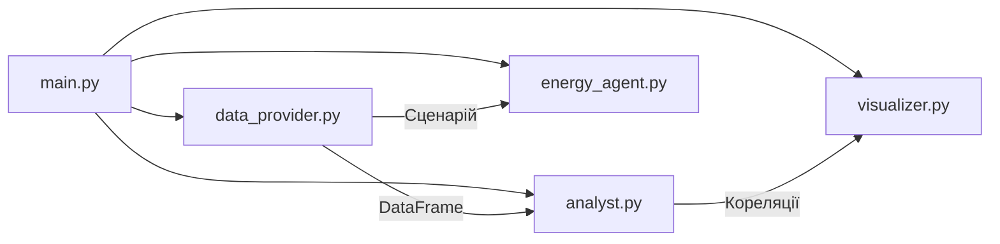

# Smart Home Energy Agent — Звіт

## 1. Опис проекту

**Smart Home Energy Agent** — інтелектуальний агент для керування енергосистемою приватного будинку, обладнаного сонячними панелями, вітрогенератором та резервним бензиновим генератором.

Система працює у два етапи:

1. **Етап навчання** — агент аналізує 365 днів згенерованих історичних погодних даних, проводить кореляційний аналіз (коефіцієнт Пірсона) і встановлює залежності між погодними умовами та обсягом генерації зеленої енергії.
2. **Етап експлуатації** — агент отримує поточні погодні умови через інтерактивне консольне меню, оцінює загальну генерацію та приймає рішення: вмикати чи вимикати бензиновий генератор залежно від покриття потреб будинку (4.5 кВт).

---

## 2. Архітектура

Проект побудований за принципами **Clean Code** та **Single Responsibility Principle** і складається з 5 модулів:

```
pjct/
├── data_provider.py    — генерація даних та сценарії погоди
├── analyst.py          — кореляційний аналіз (Пірсон)
├── energy_agent.py     — агент прийняття рішень
├── visualizer.py       — побудова графіків (Matplotlib)
└── main.py             — точка входу, оркестрація
```



### Опис модулів

| Модуль | Клас / Функція | Відповідальність |
|---|---|---|
| `data_provider.py` | `HistoricalDataGenerator` | Генерація 365 днів даних: хмарність, швидкість вітру, вихід сонячних панелей та вітрогенератора |
| | `WeatherScenarioProvider` | Фіксовані сценарії погоди для інтерактивного тестування |
| `analyst.py` | `CorrelationAnalyst` | Кореляційний аналіз Пірсона (SciPy) між погодою та генерацією |
| `energy_agent.py` | `EnergyAgent` | Оцінка генерації, порівняння з попитом, рішення по генератору |
| `visualizer.py` | `CorrelationVisualizer` | Scatter-графіки з лініями тренду та анотаціями r |
| `main.py` | `run_training_phase`, `run_visualization`, `run_interactive_loop` | Оркестрація двох етапів роботи |

---

## 3. Моделі генерації енергії

### Сонячні панелі (макс. 5.0 кВт)

Вихідна потужність залежить від хмарності лінійно:

```
solar_kw = 5.0 × (100 − cloud_cover) / 100
```

При 0% хмарності — повна потужність, при 100% — нуль.

### Вітрогенератор (макс. 3.0 кВт)

Використовується реалістична крива потужності з трьома зонами:

| Зона | Швидкість вітру | Поведінка |
|---|---|---|
| Нижче cut-in | < 3 м/с | Вихід = 0 |
| Робоча | 3–12 м/с | Квадратичне зростання |
| Вище rated | 12–25 м/с | Максимальна потужність (3 кВт) |
| Вище cut-out | > 25 м/с | Аварійна зупинка, вихід = 0 |

### Бензиновий генератор (5.0 кВт)

Вмикається автоматично, коли загальна зелена генерація **менша** за попит будинку (4.5 кВт).

---

## 4. Код модулів

### data_provider.py

```python
import numpy as np
import pandas as pd


class HistoricalDataGenerator:

    def __init__(self, days=365, seed=42):
        self.days = days
        self.rng = np.random.default_rng(seed)

    def _generate_cloud_cover(self):
        return self.rng.uniform(0, 100, self.days)

    def _generate_wind_speed(self):
        return self.rng.weibull(2, self.days) * 8

    def _calculate_solar_output(self, cloud_cover):
        max_solar_kw = 5.0
        efficiency = (100 - cloud_cover) / 100
        noise = self.rng.normal(0, 0.15, self.days)
        return np.clip(max_solar_kw * efficiency + noise, 0, max_solar_kw)

    def _calculate_wind_output(self, wind_speed):
        max_wind_kw = 3.0
        cut_in = 3.0
        rated = 12.0
        cut_out = 25.0
        output = np.zeros_like(wind_speed)
        for i, ws in enumerate(wind_speed):
            if ws < cut_in or ws > cut_out:
                output[i] = 0
            elif ws >= rated:
                output[i] = max_wind_kw
            else:
                output[i] = max_wind_kw * ((ws - cut_in) / (rated - cut_in)) ** 2
        noise = self.rng.normal(0, 0.1, self.days)
        return np.clip(output + noise, 0, max_wind_kw)

    def generate(self):
        cloud_cover = self._generate_cloud_cover()
        wind_speed = self._generate_wind_speed()
        solar_output = self._calculate_solar_output(cloud_cover)
        wind_output = self._calculate_wind_output(wind_speed)
        return pd.DataFrame({
            "cloud_cover": cloud_cover,
            "wind_speed": wind_speed,
            "solar_output_kw": solar_output,
            "wind_output_kw": wind_output,
        })


class WeatherScenarioProvider:

    SCENARIOS = {
        1: {
            "name": "Хмарно та штиль",
            "description": "Критично мало енергії",
            "cloud_cover": 95,
            "wind_speed": 1.5,
        },
        2: {
            "name": "Ідеальна погода",
            "description": "Сонце + Вітер",
            "cloud_cover": 10,
            "wind_speed": 10.0,
        },
        3: {
            "name": "Сонячно, але немає вітру",
            "description": "Тільки сонячна генерація",
            "cloud_cover": 5,
            "wind_speed": 1.0,
        },
        4: {
            "name": "Шторм",
            "description": "Хмарно, але сильний вітер",
            "cloud_cover": 90,
            "wind_speed": 15.0,
        },
    }

    def get_scenario(self, choice):
        return self.SCENARIOS.get(choice)

    def get_menu_text(self):
        lines = ["\n🏠 Оберіть погодний сценарій:"]
        for key, scenario in self.SCENARIOS.items():
            lines.append(f"  {key} — {scenario['name']} ({scenario['description']})")
        lines.append("  5 — Вихід з програми")
        return "\n".join(lines)
```

---

### analyst.py

```python
import pandas as pd
from scipy.stats import pearsonr


class CorrelationAnalyst:

    def __init__(self, data: pd.DataFrame):
        self.data = data
        self.results = {}

    def _compute_single_correlation(self, col_x, col_y):
        coefficient, p_value = pearsonr(self.data[col_x], self.data[col_y])
        return {"coefficient": coefficient, "p_value": p_value}

    def analyze_solar_correlation(self):
        result = self._compute_single_correlation("cloud_cover", "solar_output_kw")
        self.results["solar"] = result
        return result

    def analyze_wind_correlation(self):
        result = self._compute_single_correlation("wind_speed", "wind_output_kw")
        self.results["wind"] = result
        return result

    def run_full_analysis(self):
        self.analyze_solar_correlation()
        self.analyze_wind_correlation()
        return self.results

    def print_report(self):
        solar = self.results.get("solar")
        wind = self.results.get("wind")
        print("\n📊 Результати кореляційного аналізу (Пірсон):")
        print("─" * 50)
        if solar:
            print(f"  ☁️  Хмарність → Сонячна генерація:  r = {solar['coefficient']:+.4f}  (p = {solar['p_value']:.2e})")
        if wind:
            print(f"  🌬️  Швидкість вітру → Вітрова генерація: r = {wind['coefficient']:+.4f}  (p = {wind['p_value']:.2e})")
        print("─" * 50)
```

---

### energy_agent.py

```python
class EnergyAgent:

    HOUSE_DEMAND_KW = 4.5
    SOLAR_MAX_KW = 5.0
    WIND_MAX_KW = 3.0
    WIND_CUT_IN = 3.0
    WIND_RATED = 12.0
    WIND_CUT_OUT = 25.0
    GENERATOR_OUTPUT_KW = 5.0

    def __init__(self):
        self.generator_active = False

    def _estimate_solar(self, cloud_cover):
        efficiency = (100 - cloud_cover) / 100
        return self.SOLAR_MAX_KW * efficiency

    def _estimate_wind(self, wind_speed):
        if wind_speed < self.WIND_CUT_IN or wind_speed > self.WIND_CUT_OUT:
            return 0.0
        if wind_speed >= self.WIND_RATED:
            return self.WIND_MAX_KW
        return self.WIND_MAX_KW * ((wind_speed - self.WIND_CUT_IN) / (self.WIND_RATED - self.WIND_CUT_IN)) ** 2

    def _calculate_deficit(self, total_green):
        return self.HOUSE_DEMAND_KW - total_green

    def _decide_generator_action(self, deficit):
        if deficit > 0:
            self.generator_active = True
            return "START"
        self.generator_active = False
        return "STOP"

    def evaluate(self, cloud_cover, wind_speed):
        solar = self._estimate_solar(cloud_cover)
        wind = self._estimate_wind(wind_speed)
        total_green = solar + wind
        deficit = self._calculate_deficit(total_green)
        action = self._decide_generator_action(deficit)
        return {
            "solar_kw": solar,
            "wind_kw": wind,
            "total_green_kw": total_green,
            "demand_kw": self.HOUSE_DEMAND_KW,
            "deficit_kw": max(deficit, 0),
            "surplus_kw": max(-deficit, 0),
            "action": action,
            "generator_active": self.generator_active,
        }

    def print_decision(self, scenario_name, result):
        print(f"\n⚡ Сценарій: {scenario_name}")
        print("─" * 50)
        print(f"  ☀️  Сонячна генерація:   {result['solar_kw']:.2f} кВт")
        print(f"  🌬️  Вітрова генерація:    {result['wind_kw']:.2f} кВт")
        print(f"  🔋 Загальна зелена:      {result['total_green_kw']:.2f} кВт")
        print(f"  🏠 Споживання будинку:   {result['demand_kw']:.2f} кВт")
        print("─" * 50)

        if result["action"] == "START":
            print(f"  🚨 ДЕФІЦИТ: {result['deficit_kw']:.2f} кВт")
            print(f"  🔌 Рішення: УВІМКНУТИ бензиновий генератор (+{self.GENERATOR_OUTPUT_KW} кВт)")
            print(f"  ✅ Статус генератора: [ПРАЦЮЄ]")
        else:
            print(f"  💚 НАДЛИШОК: {result['surplus_kw']:.2f} кВт")
            print(f"  🔌 Рішення: генератор НЕ ПОТРІБЕН")
            print(f"  ✅ Статус генератора: [ВИМКНЕНО]")
        print("─" * 50)
```

---

### visualizer.py

```python
import numpy as np
import pandas as pd
import matplotlib.pyplot as plt
from matplotlib import rcParams


class CorrelationVisualizer:

    def __init__(self):
        rcParams["figure.dpi"] = 120
        rcParams["axes.spines.top"] = False
        rcParams["axes.spines.right"] = False
        rcParams["font.size"] = 10

    def _add_trendline(self, ax, x, y, color):
        z = np.polyfit(x, y, 1)
        p = np.poly1d(z)
        x_sorted = np.sort(x)
        ax.plot(x_sorted, p(x_sorted), color=color, linewidth=2.5, linestyle="--", alpha=0.9)

    def _style_scatter(self, ax, x, y, color, alpha=0.35, size=12):
        ax.scatter(x, y, c=color, alpha=alpha, s=size, edgecolors="none")

    def _annotate_r(self, ax, r_value, position="upper right"):
        bbox = dict(boxstyle="round,pad=0.4", facecolor="white", edgecolor="gray", alpha=0.85)
        if position == "upper right":
            xy = (0.95, 0.92)
        else:
            xy = (0.05, 0.92)
        ax.annotate(
            f"r = {r_value:+.4f}",
            xy=xy,
            xycoords="axes fraction",
            fontsize=12,
            fontweight="bold",
            ha="right" if "right" in position else "left",
            bbox=bbox,
        )

    def plot(self, data: pd.DataFrame, correlation_results: dict):
        fig, axes = plt.subplots(1, 2, figsize=(14, 5.5))
        fig.suptitle("Кореляційний аналіз: погода → генерація енергії", fontsize=14, fontweight="bold", y=1.02)

        self._plot_solar(axes[0], data, correlation_results["solar"]["coefficient"])
        self._plot_wind(axes[1], data, correlation_results["wind"]["coefficient"])

        plt.tight_layout()
        plt.savefig("correlation_analysis.png", bbox_inches="tight", facecolor="white")
        plt.show()

    def _plot_solar(self, ax, data, r_value):
        x = data["cloud_cover"]
        y = data["solar_output_kw"]
        self._style_scatter(ax, x, y, color="#FF6B35")
        self._add_trendline(ax, x, y, color="#C74B1A")
        self._annotate_r(ax, r_value)
        ax.set_xlabel("Хмарність (%)")
        ax.set_ylabel("Сонячна генерація (кВт)")
        ax.set_title("Хмарність vs Сонячна генерація")

    def _plot_wind(self, ax, data, r_value):
        x = data["wind_speed"]
        y = data["wind_output_kw"]
        self._style_scatter(ax, x, y, color="#4ECDC4")
        self._add_trendline(ax, x, y, color="#2A9D8F")
        self._annotate_r(ax, r_value, position="upper left")
        ax.set_xlabel("Швидкість вітру (м/с)")
        ax.set_ylabel("Вітрова генерація (кВт)")
        ax.set_title("Швидкість вітру vs Вітрова генерація")
```

---

### main.py

```python
import sys
sys.stdout.reconfigure(encoding="utf-8")

from data_provider import HistoricalDataGenerator, WeatherScenarioProvider
from analyst import CorrelationAnalyst
from energy_agent import EnergyAgent
from visualizer import CorrelationVisualizer


def run_training_phase():
    print("=" * 55)
    print("🧠 ЕТАП 1: НАВЧАННЯ (аналіз історичних даних)")
    print("=" * 55)
    generator = HistoricalDataGenerator(days=365)
    data = generator.generate()
    print(f"  📅 Згенеровано {len(data)} днів історичних даних")
    analyst = CorrelationAnalyst(data)
    results = analyst.run_full_analysis()
    analyst.print_report()
    return data, results


def run_visualization(data, correlation_results):
    print("\n📈 Побудова графіків кореляції...")
    visualizer = CorrelationVisualizer()
    visualizer.plot(data, correlation_results)
    print("  ✅ Графік збережено: correlation_analysis.png")


def run_interactive_loop():
    print("\n" + "=" * 55)
    print("🔄 ЕТАП 2: ЕКСПЛУАТАЦІЯ (реальний час)")
    print("=" * 55)
    agent = EnergyAgent()
    provider = WeatherScenarioProvider()

    while True:
        print(provider.get_menu_text())
        raw = input("\n👉 Ваш вибір: ").strip()
        if raw == "5":
            print("\n👋 Завершення роботи агента. До побачення!")
            break
        if not raw.isdigit() or int(raw) not in provider.SCENARIOS:
            print("⚠️  Невірний вибір, спробуйте ще раз.")
            continue
        scenario = provider.get_scenario(int(raw))
        result = agent.evaluate(scenario["cloud_cover"], scenario["wind_speed"])
        agent.print_decision(scenario["name"], result)


def main():
    print("\n🏡 Smart Home Energy Agent")
    print("━" * 55)
    data, correlations = run_training_phase()
    run_visualization(data, correlations)
    run_interactive_loop()


if __name__ == "__main__":
    main()
```

---

## 5. Результати кореляційного аналізу

Аналіз проведений на 365 днях згенерованих історичних даних за допомогою коефіцієнта кореляції Пірсона (SciPy `pearsonr`).

| Пара змінних | Коефіцієнт r | p-value | Інтерпретація |
|---|---|---|---|
| Хмарність → Сонячна генерація | **−0.9949** | 0.00e+00 | Майже ідеальна зворотна кореляція |
| Швидкість вітру → Вітрова генерація | **+0.9385** | 8.98e-170 | Сильна пряма кореляція |

> [!NOTE]
> Обидві кореляції є статистично значущими (p ≈ 0). Зворотна кореляція хмарності та сонячної генерації (r ≈ −1) підтверджує лінійну модель панелей. Кореляція вітру дещо нижча (r ≈ 0.94) через нелінійну криву потужності вітрогенератора (квадратична залежність + зони cut-in/cut-out).

### Графік кореляції


---

## 6. Тестування сценаріїв (Етап експлуатації)

Попит будинку зафіксовано на рівні **4.50 кВт**. Агент оцінює генерацію та вирішує, чи потрібен бензиновий генератор.

| # | Сценарій | Хмарність | Вітер | ☀️ Сонце | 🌬️ Вітер | Разом | Рішення | Дефіцит / Надлишок |
|---|---|---|---|---|---|---|---|---|
| 1 | Хмарно та штиль | 95% | 1.5 м/с | 0.25 кВт | 0.00 кВт | 0.25 кВт | 🚨 **ГЕНЕРАТОР ON** | −4.25 кВт |
| 2 | Ідеальна погода | 10% | 10.0 м/с | 4.50 кВт | 1.81 кВт | 6.31 кВт | 💚 Генератор OFF | +1.81 кВт |
| 3 | Сонячно, без вітру | 5% | 1.0 м/с | 4.75 кВт | 0.00 кВт | 4.75 кВт | 💚 Генератор OFF | +0.25 кВт |
| 4 | Шторм | 90% | 15.0 м/с | 0.50 кВт | 3.00 кВт | 3.50 кВт | 🚨 **ГЕНЕРАТОР ON** | −1.00 кВт |

> [!IMPORTANT]
> Сценарій 3 (сонячно, без вітру) демонструє граничний випадок: сонячна генерація самостійно покриває попит із мінімальним надлишком 0.25 кВт. Сценарій 4 (шторм) показує, що навіть максимальна вітрова генерація (3 кВт) не компенсує втрату сонячної при 90% хмарності.

---

## 7. Висновки

1. Кореляційний аналіз підтвердив сильну залежність генерації від погодних умов, що дозволяє агенту приймати обґрунтовані рішення.
2. Агент коректно вмикає резервний генератор лише при реальному дефіциті енергії, мінімізуючи використання палива.
3. Модульна архітектура (5 файлів, SRP) забезпечує легке розширення системи — наприклад, додавання акумулятора або прогнозування погоди.
4. Усі сценарії тестування дали очікувані результати, що підтверджує коректність фізичних моделей генерації.

---

## 8. Використані технології

| Технологія | Призначення |
|---|---|
| Python 3.13 | Мова програмування |
| NumPy | Генерація даних, математичні операції |
| Pandas | Структурування даних (DataFrame) |
| SciPy | Кореляційний аналіз Пірсона |
| Matplotlib | Візуалізація результатів |
